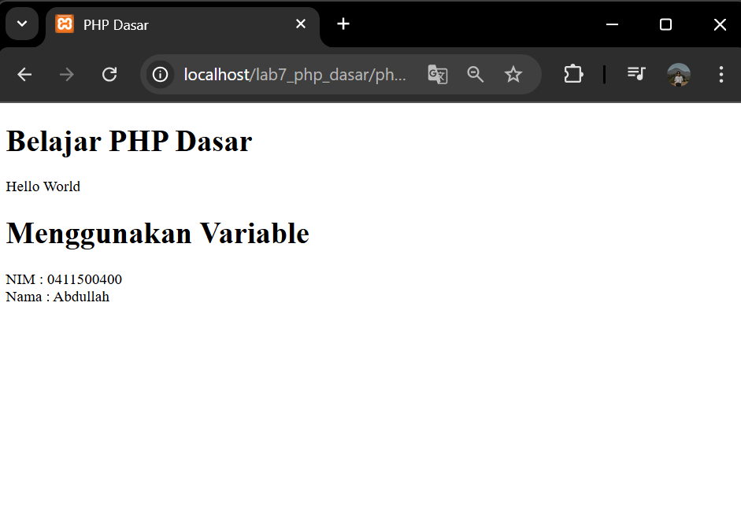

# Tugas Praktikum Pemrograman Web (PHP)

#### Menjalankan Web Server

# 

#### 1. Buat folder lab7_php_dasar pada root directory web server (d:\xampp\htdocs)

# 

#### 2. mengakses direktory tersebut pada web server dengan mengakses URL: http://localhost/lab7_php_dasar/

# 

#### 3. Buat file baru dengan nama php_dasar.php

# 

#### 4. Variable PHP
# 

#### 5. Predefine Variable

# 

#### 6. Membuat Form Input

#  

#### 7. Operator Kondisi IF Kondisi Switch Perulangan for Perulangan dowhile

# 

### Pertanyaan dan Tugas
Buatlah program PHP sederhana dengan menggunakan form input yang menampilkan
nama, tanggal lahir dan pekerjaan. Kemudian tampilkan outputnya dengan menghitung
umur berdasarkan inputan tanggal lahir. Dan pilihan pekerjaan dengan gaji yang
berbeda-beda sesuai pilihan pekerjaan.

#### 1. Membuat File file bernama form_umur_gaji.php

 

#### 2. Hasil

# 

#### 3. Test 1

 

#### 4. Test 2

# 

## Penjelasan
### Hasil Input
Nama: Ahmad Zulfa
Tanggal Lahir: 2003-01-16
Pekerjaan: Programmer

### Output:
Nama: Ahmad
Tanggal Lahir: 2003-01-16
Umur: 21 tahun
Pekerjaan: Programmer
Gaji: Rp. 8.000.000

## test 2
### Hasil Input
Nama: Ahmad
Tanggal Lahir: 2007-01-01
Pekerjaan: Programmer

### Output:
Nama: Ahmad
Tanggal Lahir: 2007-01-01
Umur: 17 tahun
Pekerjaan: Desainer
Gaji: Rp. 7.000.000
